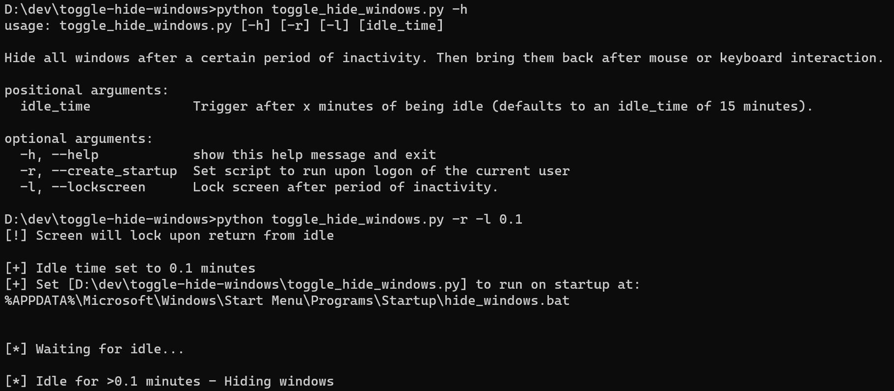

## Toggle hiding all windows upon idle

- Hide windows after idle for 10 minutes, intended for usage with wallpaper engine backgrounds, but will work with other screensavers.
- Any interaction (keyboard usage, mouse movement) will bring windows back.

### Running with Python3:
Call the script from the command line. Providing no arguments will set an idle_time trigger of 15 minutes.

```python
py toggle_hide_windows.py -h
```
OR

```python
python toggle_hide_windows.py -h
```


### Script Usage



### TODO:

- [x] Set any interaction to bring windows back
- [x] Run on startup with windows hidden
- [x] Add command line argument to trigger after x minutes of being idle
- [x] Add command line argument to specify whether to run upon logon of current user
- [x] Add command line argument to lock screen after trigger (upon user returning)
- [ ] Add command line argument to choose if script should hide after running.
- [ ] Hide desktop icons when minimizing
- [ ] Remember how desktop icons were set before minimizing (no point bringing them back if the user had them hidden before)
